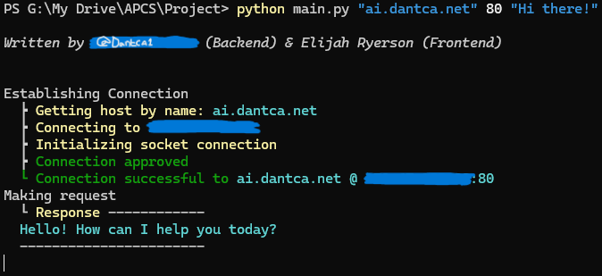

# Getting started
## Project for AP Computer Science
No extra dependencies needed.

Just run `python main.py "ai.dantca.net" 80 "Hi there!"` to start the script

- The first argument, `"ai.dantca.net"`, is the hostname for the server created by **[DanTCA1](https://github.com/DanTCA1)**. This server hosts an AI utilizing the **[ChatRTX](https://www.nvidia.com/en-us/ai-on-rtx/chatrtx/)** model that can be installed on Nvidia RTX GPUs. Connecting via websocket.
- The second argument, `80`, is the port that which the program connects to. Port 80 because that is the default HTTP port.
- The third argument, `"Hi there!"`, is the data that is being sent to the server with the hostname provided that sends right when the python script starts. If this field is left blank, then there will be no request on startup.
- If none of these arguments are specified, the script will still run, defaulting to hostname `ai.dantca.net` and port `80`.

Once you start the script with the command `$ python main.py "ai.dantca.net" 80`, it will look something like this:

Or, alternatively, if you added a third data argument, it should look like this:

Where there is a text caret, you can type anything to make a request to the server with the data you type, or you can type `close` to close the socket and shutdown the program.

Everytime you make a request, it will add another one of those `Making request` bodies to the console.

After you enter `close` it should look something like this:

