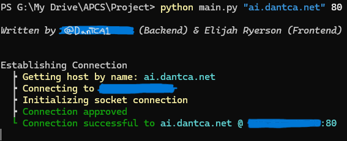

# Getting started
## Project for AP Computer Science
`pip install pyaudio pyttsx3 SpeechRecognition setuptools`

Just run `python main.py` to start the script

Once you start the script with the command `$ python main.py`, it will look something like this:

If you try and speak through your microphone, it will tell you to say the word start into your micorphone.

Once you do say "start" you will then see this screen

Now, you can say anything and it will make a request to the AI.

If you type "override" on your keyboard then the program will switch to text input mode.

Where there is a text caret, you can type anything to make a request to the server with the data you type, or you can type `close` to close the socket and shutdown the program.

Everytime you make a request, it will add another one of those `Making request` bodies to the console.

After you enter `close` it should look something like this:

